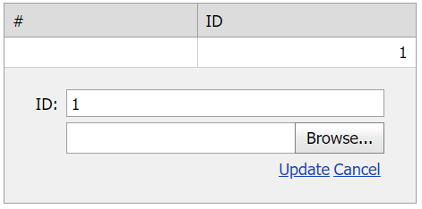

# Grid View for ASP.NET Web Forms - How to upload files and save them to a binary column in edit mode
<!-- run online -->
**[[Run Online]](https://codecentral.devexpress.com/t285123/)**
<!-- run online end -->

This example demonstrates how to create a binary column's edit item template and add an upload control to the template to upload files in edit mode. A user can also delete uploaded files after they are uploaded.



## Overview

Create an invisible binary column and set its [EditFormSettings](https://docs.devexpress.com/AspNet/DevExpress.Web.GridViewDataColumn.EditFormSettings) to `true` to make the column visible in edit mode. Specify the column's [EditItemTemplate](https://docs.devexpress.com/AspNet/DevExpress.Web.GridViewDataColumn.EditItemTemplate) property and add an upload control, a label, and a **Delete** button to the template to upload files in edit mode.

```aspx
<dx:GridViewDataTextColumn Visible="false" VisibleIndex="2">
    <EditFormSettings Visible="True" />
    <EditItemTemplate>
        <dx:ASPxUploadControl ID="ASPxUploadControl1" runat="server" AutoStartUpload="true"
            UploadMode="Auto" OnFileUploadComplete="ASPxUploadControl1_FileUploadComplete">
            <ClientSideEvents FileUploadComplete="OnFileUploadComplete" />
        </dx:ASPxUploadControl>
        <dx:ASPxLabel ID="ASPxLabel1" runat="server" ClientInstanceName="lblFileName" />
        <dx:ASPxButton ID="ASPxButton1" RenderMode="Link" runat="server" Text="Remove"
            ClientVisible="false" ClientInstanceName="btnDeleteFile" AutoPostBack="false">
            <ClientSideEvents Click="OnClick" />
        </dx:ASPxButton>
    </EditItemTemplate>
</dx:GridViewDataTextColumn>
```

Handle the upload control's server-side [FileUploadComplete](https://docs.devexpress.com/AspNet/DevExpress.Web.ASPxUploadControl.FileUploadComplete) event. In the handler, use the [UploadedFile](https://docs.devexpress.com/AspNet/DevExpress.Web.FileUploadCompleteEventArgs.UploadedFile) argument property to save the uploaded file's content to the session and pass the file's name to the client.

```cs
protected void ASPxUploadControl1_FileUploadComplete(object sender, DevExpress.Web.FileUploadCompleteEventArgs e) {
    if(e.IsValid) {
        Session[SessionKey] = e.UploadedFile.FileBytes;
        e.CallbackData = e.UploadedFile.FileName;
    }
}
```

Handle the upload control's client-side [FileUploadComplete](https://docs.devexpress.com/AspNet/js-ASPxClientUploadControl.FileUploadComplete) event. In the handler, assign the uploaded file's name to the label and make the **Delete** button visible.

```js
function OnFileUploadComplete(s, e) {
    if (e.callbackData !== "") {
        lblFileName.SetText(e.callbackData);
        btnDeleteFile.SetVisible(true);
    }
}
```

To update data in the grid, handle the grid's server-side [RowUpdating](https://docs.devexpress.com/AspNet/DevExpress.Web.ASPxGridView.RowUpdating) event. In the handler, use the [NewValues](https://docs.devexpress.com/AspNet/DevExpress.Web.Data.ASPxDataUpdatingEventArgs.NewValues) argument property to assign the uploaded file's content from the session to the binary column. To update the data source, handle its [Updating](https://learn.microsoft.com/en-us/dotnet/api/system.web.ui.webcontrols.sqldatasource.updating?view=netframework-4.8) event.

```cs
protected void ASPxGridView1_RowUpdating(object sender, DevExpress.Web.Data.ASPxDataUpdatingEventArgs e) {
    if (Session[SessionKey] != null)
        e.NewValues["Picture"] = Session[SessionKey];
    DeleteUploadedFileFormSession();
    // ...
}

protected void SqlDataSource1_Updating(object sender, System.Web.UI.WebControls.SqlDataSourceCommandEventArgs e) {
    SqlParameter sqlVarBinaryParameter = (SqlParameter)e.Command.Parameters[0];
    sqlVarBinaryParameter.SqlDbType = SqlDbType.VarBinary;
}
```

When a user clicks the **Delete** button, the callback control sends a callback to the server and passes the uploaded file's name to the server. On the server, handle the callback control's `Callback` event to delete file data from the current session. To complete the delete operation on the client, handle the callback control's `CallbackComplete` event. In the handler, clear label text and hide the **Delete** button.

```js
function OnClick(s, e) {
    callback.PerformCallback(lblFileName.GetText());
}
function OnCallbackComplete(s, e) {
    if (e.result === "ok") {
        lblFileName.SetText(null);
        btnDeleteFile.SetVisible(false);
    }
}
```

```cs
protected void ASPxCallback1_Callback(object source, DevExpress.Web.CallbackEventArgs e) {
    DeleteUploadedFileFormSession();
    e.Result = "ok";
}

private void DeleteUploadedFileFormSession() {
    Session.Remove(SessionKey);
}
```

## Files to Review

* [CustomExceptions.cs](./CS/App_Code/CustomExceptions.cs) (VB: [CustomExceptions.vb](./VB/App_Code/CustomExceptions.vb))
* [CreateSimpleDBScript.sql](./CS/CreateSimpleDBScript.sql)
* [Default.aspx](./CS/Default.aspx) (VB: [Default.aspx](./VB/Default.aspx))
* [Default.aspx.cs](./CS/Default.aspx.cs) (VB: [Default.aspx.vb](./VB/Default.aspx.vb))

## Documentation

* [Grid View Templates](https://docs.devexpress.com/AspNet/3718/components/grid-view/concepts/templates)

## More Examples

* [Grid View for ASP.NET Web Forms - How to upload files in edit mode and see them on a click in browse mode](https://github.com/DevExpress-Examples/aspxgridview-upload-files)
